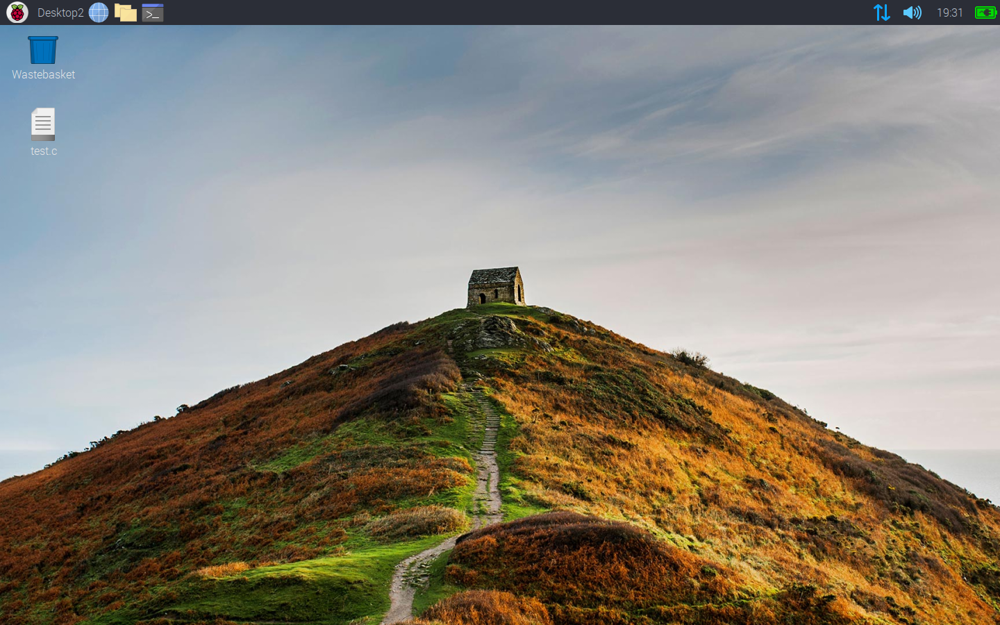

# Wallpaper script: contents
Script that changes desktop background to the bing.com daily wallpaper.
- [Overview](#overview)
- [Executing the script](#executing-the-script)
- [Script options and help](#script-options-and-help)
- [Setting up the script](#setting-up-the-script)
- [Python version](#python-version)
- [C version](#C-version)
- [Notes](#notes)

## Overview
The bing.com search engine displays a different background every day.
This image is only available for download  with a watermark through the website.
However, when taking a closer look at the html header of the bing.com website,
the URL and other information of the daily wallpaper can be found in the metadata.

> `<meta property="og:image" content="..." />`
> `{"Description":"...","Image":{`

The script extracts the URL and description from the metadata via a regex 
and tweaks the found URL to obtain the image without bing.com watermark.
The wallpaper is saved to the raspbian default dir. 
> /usr/share/rpd-wallpaper

The description is also dowloaded and stored in the file:
> /usr/share/rpd-wallpaper/description.txt 

Consequently, the wallpaper is changed. 

### Executing the script
Executing the script is possible via:
> `bash Wallpaper.sh [-hHqQvV]`
> (alternative) `./Wallpaper.sh [-hHqQvV]`

### Script options and help
The wallpaper script can be executed as is i.e. without any arguments.
Optional arguments include
* -q | -Q Quiet mode, no output shown
* -v | -V Verbose mode

Help can be accessed via the -h | -H argument.

## Setting up the script    
1. Download the script via git.

>`git clone https://github.com/ReinerVerret/Wallpaper_script.git`

1. (Alternative) Download the script as a .zip file & extract to folder in documents via.

> `wget https://github.com/ReinerVerret/Wallpaper_script/archive/refs/heads/master.zip`  
> `unzip master.zip -d /home/pi/Documents`

2. Make executable

After changing to the directory containing the Wallpaper.sh script.

> `chmod 755 Wallpaper.sh`

The script is now executable (view: [Executing the script](#executing-the-script)).

## Python version 
In the python branch a new version of the script can be found which is implemented in Python (3.7).
This script has same basic functions and even couple new options.
To view all options run the script with the -h argument. 
(See: [Python branch](../../tree/python_version))

## C version
A C version of the wallpaper script can be found in the C_version branch. 
This script basically mirrors the use of the python version script.
To view all options run the script with the --help or --usage argument. 
(See: [C branch](../../tree/C_version))

### Notes
